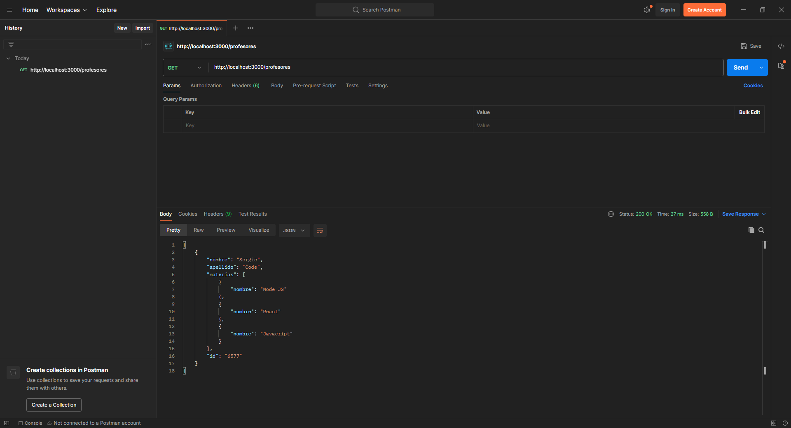

# Proyecto: JSON-Server con Node JS

Este proyecto es útil para probar un frontend.

## Paquetes de Node JS

- [json-server](https://www.npmjs.com/package/json-server).

## Prueba con Postman

Autor: Ing. Andres Chaparro
